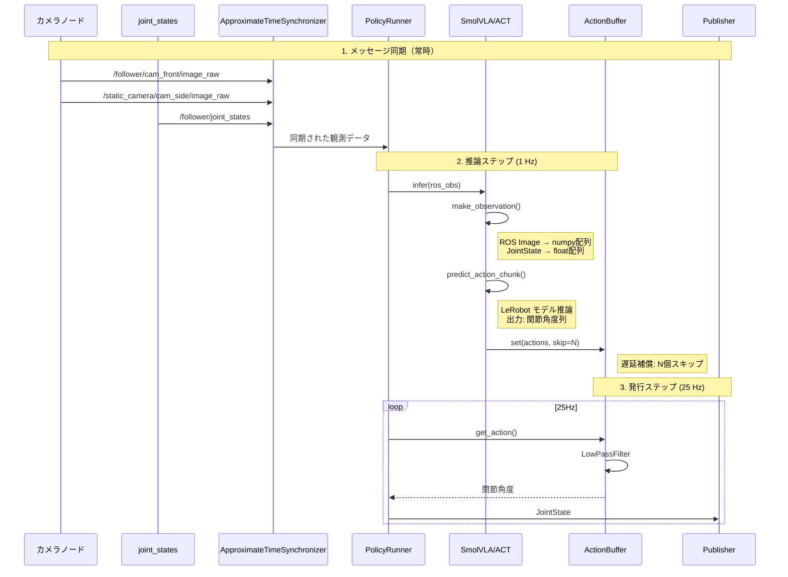
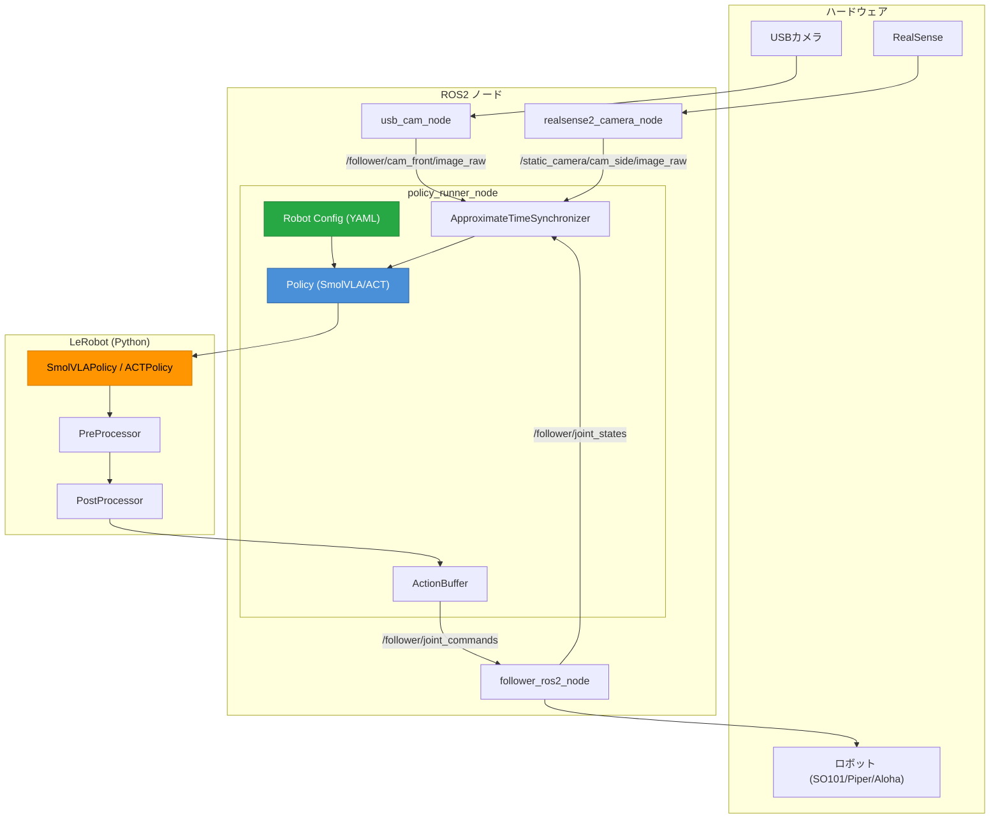

# policy_runner_node ドキュメント

LeRobot の学習済みモデルを ROS2 で動かすためのノード。

---

## 概要

`policy_runner_node` は、LeRobot で学習したモデル（SmolVLA / ACT など）を使って、
カメラ映像とロボット状態から関節角度を推論し、ROS2 トピックに出力するノードです。

```
┌─────────────────────────────────────────────────────────────────┐
│                      policy_runner_node                          │
│  ┌─────────────┐    ┌─────────────┐    ┌─────────────┐          │
│  │   ROS2      │    │   LeRobot   │    │   ROS2      │          │
│  │ Subscribe   │ -> │   Policy    │ -> │  Publish    │          │
│  │ (観測)      │    │  (推論)     │    │ (アクション) │          │
│  └─────────────┘    └─────────────┘    └─────────────┘          │
└─────────────────────────────────────────────────────────────────┘
```

---

## ファイル構成

```
so101_ros2_bridge/
├── so101_ros2_bridge/
│   ├── policy_runner_ros2_node.py   # エントリーポイント
│   ├── policy/
│   │   ├── runner.py                # PolicyRunner (LifecycleNode)
│   │   ├── base.py                  # BasePolicy, PolicyConfig
│   │   ├── registry.py              # ポリシーレジストリ (@register_policy)
│   │   ├── smolvla.py               # SmolVLA ポリシー実装
│   │   └── act.py                   # ACT ポリシー実装
│   └── utils/
│       ├── conversion.py            # ROS <-> LeRobot 変換
│       ├── buffer.py                # ActionBuffer
│       └── filtering.py             # LowPassFilter
└── config/
    ├── robots/                      # ロボット設定ファイル
    │   ├── so101.yaml               # SO101 (6-DOF)
    │   ├── piper.yaml               # Piper (7-DOF)
    │   └── aloha.yaml               # Aloha (双腕14-DOF)
    └── policies/
        ├── io.yaml                  # 入出力トピック設定
        ├── smolvla.yaml             # SmolVLA 固有設定
        └── so101_policy_params.yaml # 共通パラメータ
```

---

## ROS2 トピック

### Subscribe（入力）

| トピック | メッセージ型 | 説明 |
|---------|------------|------|
| `/follower/cam_front/image_raw` | sensor_msgs/Image | アーム先端カメラ |
| `/static_camera/cam_side/color/image_raw` | sensor_msgs/Image | 俯瞰カメラ |
| `/follower/joint_states` | sensor_msgs/JointState | 現在の関節角度 |

### Publish（出力）

| トピック | メッセージ型 | 説明 |
|---------|------------|------|
| `/follower/joint_commands` | sensor_msgs/JointState | 推論された関節角度（コマンド） |

### 設定ファイル (io.yaml)

```yaml
# config/policies/io.yaml
observations:
  observation.images.camera1:
    topic: "/follower/cam_front/image_raw"
    msg_type: "sensor_msgs/msg/Image"

  observation.images.camera2:
    topic: "/static_camera/cam_side/color/image_raw"
    msg_type: "sensor_msgs/msg/Image"

  observation.state:
    topic: "/follower/joint_states"
    msg_type: "sensor_msgs/msg/JointState"

action:
  topic: "/follower/joint_commands"
  msg_type: "sensor_msgs/msg/JointState"
```

---

## パラメータ

### 共通パラメータ (so101_policy_params.yaml)

```yaml
/**:
  ros__parameters:
    # ロボット設定
    robot: "so101"                      # ロボット名 (so101, piper, aloha)

    # ポリシー設定
    policy_name: "smolvla"              # 使用するポリシー (smolvla, act)
    device: cuda:0                      # 推論デバイス
    checkpoint_path: "/path/to/model"   # 学習済みモデルのパス
    task: "Pick the cube"               # タスク指示（言語条件付け）

    # タイミング設定
    inference_rate: 1.0     # Hz - 推論実行レート
    publish_rate: 25.0      # Hz - アクション出力レート
    inference_delay: 0.5    # sec - 推論遅延補償

    # メッセージ同期
    sync.queue_size: 20     # バッファサイズ
    sync.slop: 0.1          # 許容時間差 [sec]
```

### ロボット設定ファイル (config/robots/so101.yaml)

```yaml
# SO101 Follower Arm Configuration
robot_type: so101_follower

# 関節名（順序が重要）
joint_names:
  - shoulder_pan
  - shoulder_lift
  - elbow_flex
  - wrist_flex
  - wrist_roll
  - gripper
```

新しいロボットを追加するには、`config/robots/<robot_name>.yaml` を作成します。

### SmolVLA 固有パラメータ (smolvla.yaml)

```yaml
lpf_filtering:
  enable: True    # アクション平滑化フィルタ
  alpha: 0.1      # 平滑化係数 (0.0-1.0, 小さいほど滑らか)
```

---

## 起動方法

### 方法1: Launch ファイル

```bash
# SmolVLA で SO101 を動かす
ros2 launch so101_bringup policy.launch.py \
    robot:=so101 \
    policy_name:=smolvla \
    checkpoint_path:=/home/user/models/smolvla_checkpoint \
    task:="Pick the red cube and place it in the bowl"

# ACT で Piper を動かす
ros2 launch so101_bringup policy.launch.py \
    robot:=piper \
    policy_name:=act \
    checkpoint_path:=/home/user/models/act_checkpoint
```

### 方法2: 直接起動

```bash
ros2 run so101_ros2_bridge policy_runner_ros2_node \
    --ros-args \
    -p robot:=so101 \
    -p policy_name:=smolvla \
    -p checkpoint_path:=/home/user/models/smolvla_checkpoint \
    -p task:="Pick the red cube" \
    -p device:=cuda:0
```

### 方法3: LifecycleNode として起動

```bash
# ノード起動
ros2 run so101_ros2_bridge policy_runner_ros2_node

# 別ターミナルで状態遷移
ros2 lifecycle set /policy_runner configure
ros2 lifecycle set /policy_runner activate

# 停止
ros2 lifecycle set /policy_runner deactivate
ros2 lifecycle set /policy_runner cleanup
```

---

## ポリシーレジストリ

新しいVLAポリシーを追加するには、`@register_policy` デコレータを使います。

### 対応ポリシー

| ポリシー名 | クラス | 説明 |
|-----------|--------|------|
| `smolvla` | SmolVLA | VLM (Vision-Language Model) ベースのポリシー |
| `act` | ACT | Action Chunking Transformer |

### 新規ポリシーの追加方法

```python
# so101_ros2_bridge/policy/my_policy.py
from .base import BasePolicy, PolicyConfig
from .registry import register_policy

@register_policy('my_policy')
class MyPolicy(BasePolicy):
    def __init__(self, cfg: PolicyConfig, node: Node):
        super().__init__(cfg, node)
        # モデルのロード
        self.model = MyModel.from_pretrained(cfg.checkpoint_path)

    def make_observation(self, ros_obs):
        # ROS メッセージ → モデル入力形式
        ...

    def predict_action_chunk(self, observation, time_per_action, inference_delay):
        # 推論実行 → アクションバッファに格納
        ...

    def get_action(self):
        # バッファから次のアクションを取得
        return self._action_buffer.get()

    def reset(self, context=None):
        # エピソードリセット
        ...
```

`policy/__init__.py` にインポートを追加:
```python
from . import my_policy  # noqa: F401
```

---

## 推論パイプライン詳細



---

## LeRobot との接続部分

### 1. モデルの読み込み (smolvla.py)

```python
from lerobot.policies.smolvla.modeling_smolvla import SmolVLAPolicy

# LeRobot のモデルをロード
self.model = SmolVLAPolicy.from_pretrained(
    checkpoint_path,
    local_files_only=True
).to(device)
self.model.eval()

# 前処理・後処理
self._pre_processor, self._post_processor = make_pre_post_processors(
    self.model.config,
    checkpoint_path,
)
```

### 2. ROS メッセージ → LeRobot 形式 (conversion.py)

```python
def ros_image_to_hwc_uint8(msg: Image) -> np.ndarray:
    """ROS Image → numpy配列 (H, W, C) uint8"""
    # rgb8, bgr8, mono8 対応
    arr = np.frombuffer(msg.data, dtype=np.uint8)
    arr = arr.reshape(msg.height, msg.width, channels)
    return arr

def ros_jointstate_to_vec(js_msg: JointState, joint_order: List[str]):
    """JointState → 指定順序の float配列"""
    name_to_idx = {n: i for i, n in enumerate(js_msg.name)}
    vals = [js_msg.position[name_to_idx[n]] for n in joint_order]
    return np.asarray(vals, dtype=np.float32)
```

### 3. 推論の実行 (smolvla.py)

```python
def make_observation(self, ros_obs) -> EnvTransition:
    """ROS観測 → LeRobot EnvTransition"""
    # 1. ROS メッセージを raw 値に変換
    raw_obs = ros_to_dataset_features(ros_obs, joint_order, input_features)

    # 2. LeRobot の推論フレーム形式に変換
    inference_frame = build_inference_frame(
        observation=raw_obs,
        ds_features=self.dataset_features,
        device=self._device,
        task=self._task,           # タスク指示
        robot_type=self._robot_type,
    )

    # 3. 前処理（正規化など）
    return self._pre_processor(inference_frame)

def predict_action_chunk(self, observation, time_per_action, inference_delay):
    """推論実行"""
    # モデル推論: [B, T, n_joints] のアクション列を取得
    actions = self.model.predict_action_chunk(observation)

    # 後処理（非正規化）
    actions = self._post_processor(actions)
    actions_list = actions[0].cpu().numpy().tolist()

    # 遅延補償: 推論にかかった時間分のアクションをスキップ
    skip_actions = math.ceil(inference_delay / time_per_action)

    # バッファに格納
    self._action_buffer.set(actions_list, start_index=skip_actions)
```

### 4. アクション出力 (runner.py)

```python
def _publish_step(self):
    """25Hz でアクションを発行"""
    # バッファから次のアクションを取得
    action = self._policy.get_action()
    if action is None:
        return

    # JointState メッセージ構築
    js_cmd = JointState()
    js_cmd.header.stamp = self.get_clock().now().to_msg()
    js_cmd.name = self._action_joint_names
    js_cmd.position = list(action)

    self._cmd_pub.publish(js_cmd)
```

---

## 実行例

### 前提条件

1. LeRobot でモデルを学習済み
2. チェックポイントがローカルに保存されている
3. カメラノードが起動している
4. ロボットブリッジノードが起動している

### 完全な起動手順

```bash
# ターミナル1: ロボットブリッジ
ros2 launch so101_bringup robot.launch.py

# ターミナル2: カメラ
ros2 launch so101_bringup cameras.launch.py

# ターミナル3: 推論ノード
ros2 launch so101_bringup policy.launch.py \
    checkpoint_path:=/home/user/lerobot_outputs/smolvla_pick_place/checkpoints/last \
    task:="Pick the red cube and place it in the blue bowl"

# ターミナル4: LifecycleNode を activate
ros2 lifecycle set /policy_runner configure
ros2 lifecycle set /policy_runner activate
```

### トピック確認

```bash
# 入力トピック確認
ros2 topic echo /follower/cam_front/image_raw --no-arr
ros2 topic echo /follower/joint_states

# 出力トピック確認
ros2 topic echo /follower/joint_commands
```

---

## アーキテクチャ図



---

## トラブルシューティング

### 観測が受信されない

```bash
# トピックが発行されているか確認
ros2 topic list | grep -E "(image_raw|joint_states)"
ros2 topic hz /follower/cam_front/image_raw
ros2 topic hz /follower/joint_states
```

### 推論が遅い

- `device` パラメータを `cuda:0` に設定
- `inference_rate` を下げる（例: 0.5 Hz）

### アクションがガタガタする

- `lpf_filtering.enable: True` に設定
- `lpf_filtering.alpha` を小さくする（例: 0.05）

### チェックポイントが見つからない

```bash
# パスが正しいか確認
ls -la /path/to/checkpoint/

# 必要なファイルがあるか確認
# - config.json
# - model.safetensors または pytorch_model.bin
```

---

## 関連ドキュメント

- [system_overview.md](system_overview.md) - システム全体構成
- [technical_details.md](technical_details.md) - 技術詳細
- LeRobot: https://github.com/huggingface/lerobot
