# VR テレオペレーション × LeRobot 学習システム構成図

## 概要

複数のロボットアーム（SO101、Piper、Daihen等）をVR（Quest 3）でテレオペレーションし、収集したデータをLeRobotで学習させるシステムの構成図。

**特徴:**
- 🤖 マルチロボット対応（設定ファイルで切り替え）
- 🥽 VRテレオペレーション（Quest 3）
- 🧠 模倣学習（SmolVLA / ACT）
- 🎮 シミュレーション連携（MuJoCo / Isaac Sim）

---

## 0. ノード関係図（シンプル版）

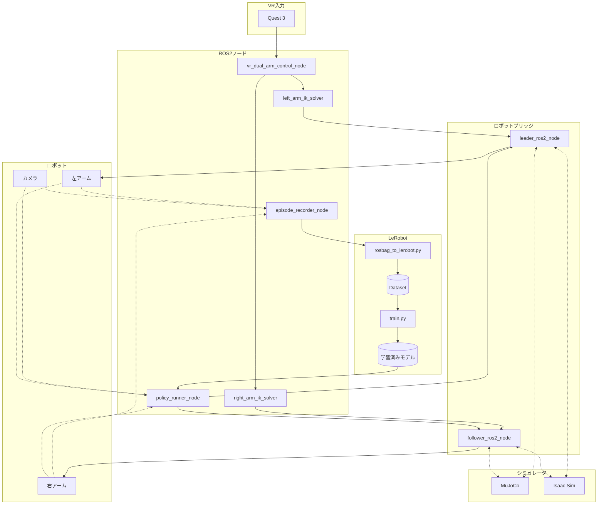

### ノード一覧

| ノード | 役割 |
|--------|------|
| **vr_dual_arm_control_node** | VR入力を左右アームの目標ポーズに変換 |
| **left_arm_ik_solver** | 左アーム逆運動学（KDL） |
| **right_arm_ik_solver** | 右アーム逆運動学（KDL） |
| **leader_ros2_node** | 左アーム制御ドライバー |
| **follower_ros2_node** | 右アーム制御ドライバー |
| **episode_recorder_node** | エピソード記録（ROS2 Bag） |
| **policy_runner_node** | 学習済みモデル推論 |

### LeRobot連携

| コンポーネント | 役割 |
|---------------|------|
| **rosbag_to_lerobot.py** | ROS2 Bag → LeRobot Dataset変換 |
| **train.py** | LeRobot学習スクリプト |
| **学習済みモデル** | SmolVLA / ACT チェックポイント |

---

## 1. システム全体構成図

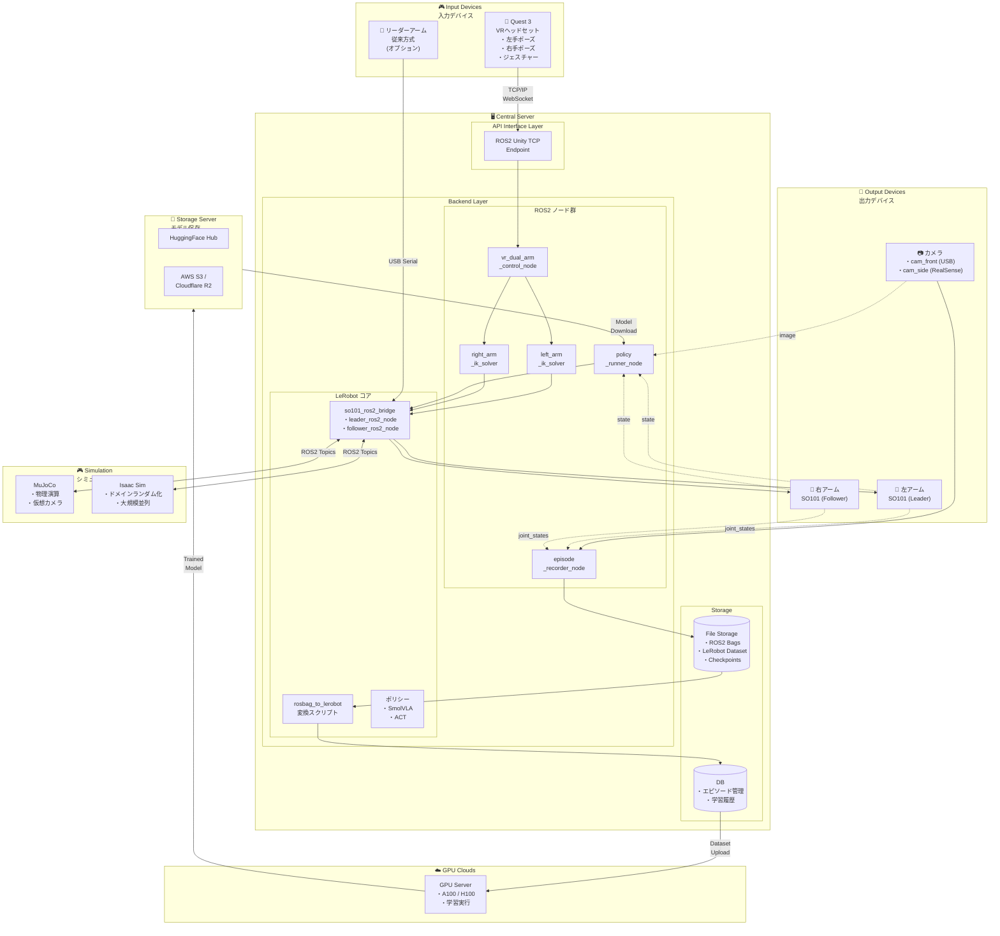

---

## 2. データフロー図

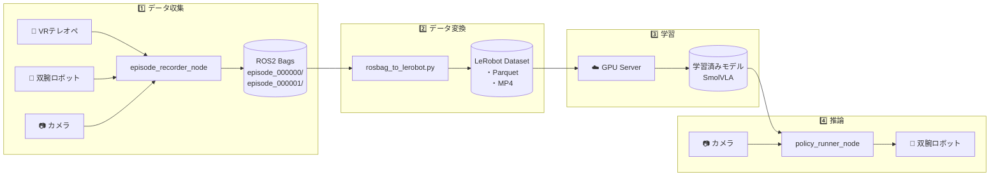

---

## 3. VRテレオペレーション詳細

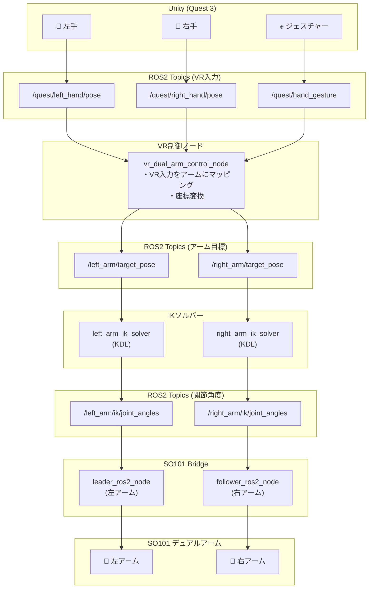

---

## 4. 学習パイプライン詳細

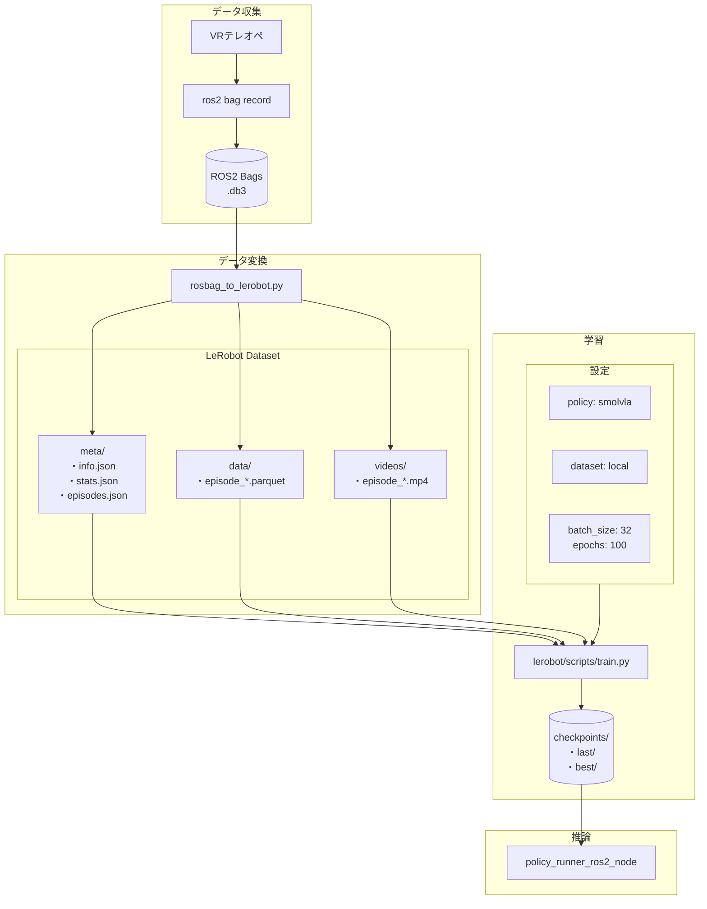

---

## 5. シミュレーション連携

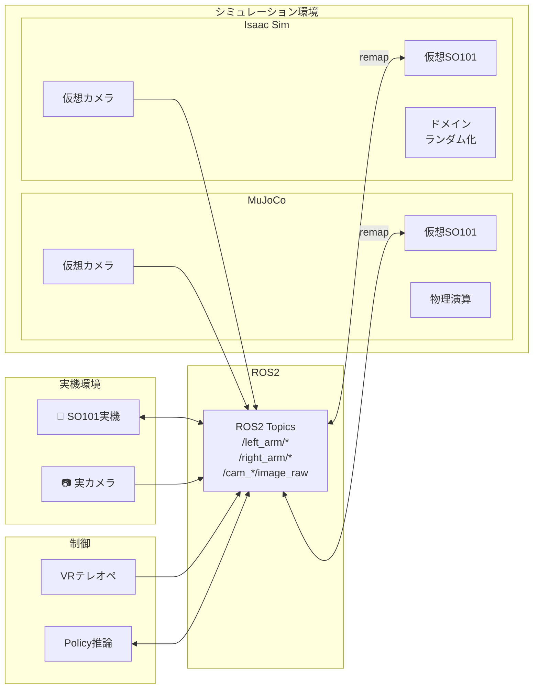

---

## 6. エピソード記録シーケンス

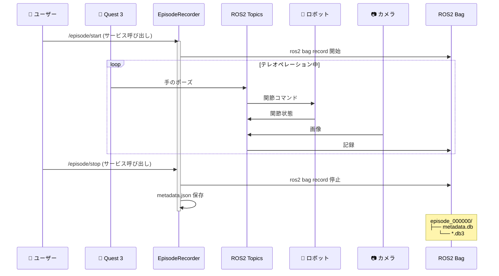

---

## 7. 推論シーケンス

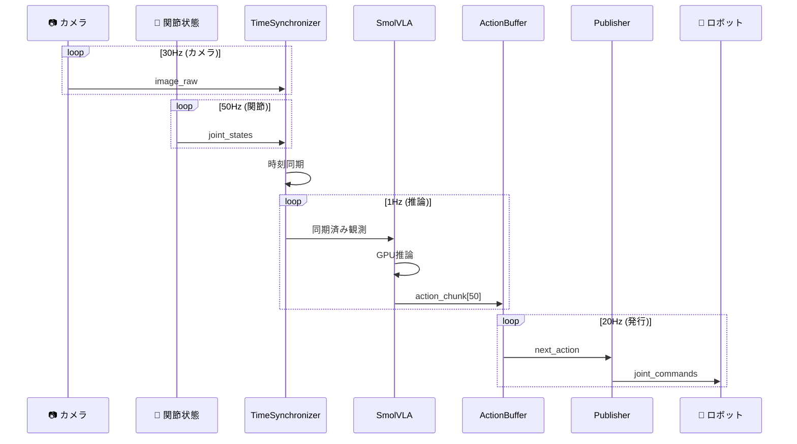

---

## 8. コンポーネント一覧

| カテゴリ | コンポーネント | 説明 |
|---------|---------------|------|
| **入力** | Quest 3 | VRヘッドセット、手のポーズ・ジェスチャー |
| **入力** | リーダーアーム | 従来方式のテレオペ入力（オプション） |
| **ROS2ノード** | vr_dual_arm_control_node | VR入力→左右アームマッピング |
| **ROS2ノード** | left_arm_ik_solver_node | 左アームIK計算（KDL） |
| **ROS2ノード** | right_arm_ik_solver_node | 右アームIK計算（KDL） |
| **ROS2ノード** | episode_recorder_node | エピソード記録管理 |
| **ROS2ノード** | policy_runner_node | 学習済みモデル推論 |
| **ブリッジ** | leader_ros2_node | 左アーム制御（LeRobot API） |
| **ブリッジ** | follower_ros2_node | 右アーム制御（LeRobot API） |
| **変換** | rosbag_to_lerobot.py | ROS2 Bag→LeRobot Dataset |
| **出力** | SO101 左アーム | Feetech STS3215サーボ |
| **出力** | SO101 右アーム | Feetech STS3215サーボ |
| **出力** | カメラ | USB cam / RealSense |
| **シミュレータ** | MuJoCo | 物理シミュレーション |
| **シミュレータ** | Isaac Sim | NVIDIA GPU シミュレーション |
| **学習** | SmolVLA | Vision-Language-Action モデル |
| **学習** | ACT | Action Chunking Transformer |

---

## 9. トピック一覧

### VR入力トピック

| トピック | 型 | 説明 |
|---------|-----|------|
| `/quest/left_hand/pose` | PoseStamped | VR左手ポーズ |
| `/quest/right_hand/pose` | PoseStamped | VR右手ポーズ |
| `/quest/left_hand/joints` | PointCloud | 左手21関節座標 |
| `/quest/right_hand/joints` | PointCloud | 右手21関節座標 |
| `/quest/hand_gesture` | HandGesture | ジェスチャー |

### 内部トピック

| トピック | 型 | 説明 |
|---------|-----|------|
| `/left_arm/target_pose` | PoseStamped | 左アーム目標ポーズ |
| `/right_arm/target_pose` | PoseStamped | 右アーム目標ポーズ |
| `/left_arm/ik/joint_angles` | JointState | 左アームIK結果 |
| `/right_arm/ik/joint_angles` | JointState | 右アームIK結果 |
| `/left_arm/joint_states` | JointState | 左アーム現在状態 |
| `/right_arm/joint_states` | JointState | 右アーム現在状態 |
| `/left_arm/joint_commands` | JointState | 左アームコマンド |
| `/right_arm/joint_commands` | JointState | 右アームコマンド |

### カメラトピック

| トピック | 型 | 説明 |
|---------|-----|------|
| `/follower/cam_front/image_raw` | Image | 前面カメラ画像 |
| `/static_camera/cam_side/color/image_raw` | Image | サイドカメラ画像 |

---

## 10. 使用方法

### データ収集

```bash
# 1. VRテレオペ + ロボット起動
ros2 launch unity_robot_control vr_dual_arm_teleop.launch.py

# 2. エピソード記録ノード起動
ros2 run unity_robot_control episode_recorder_node

# 3. 記録開始/停止
ros2 service call /episode/start std_srvs/srv/Trigger
# ... テレオペ操作 ...
ros2 service call /episode/stop std_srvs/srv/Trigger
```

### データ変換

```bash
# ROS2 Bag → LeRobot Dataset
python3 rosbag_to_lerobot.py \
    --input-dir ~/ros2_bags \
    --output-dir ~/lerobot_dataset \
    --fps 30
```

### 学習

```bash
# LeRobotで学習
python lerobot/scripts/train.py \
    policy=smolvla \
    dataset.root=~/lerobot_dataset \
    training.batch_size=32 \
    training.num_epochs=100
```

### 推論

```bash
# 学習済みモデルで推論
ros2 run so101_ros2_bridge policy_runner_ros2_node --ros-args \
    -p checkpoint_path:=~/outputs/checkpoints/last \
    -p device:=cuda:0
```

---

## 11. マルチロボット対応アーキテクチャ

複数のロボットアームに対応するため、抽象化レイヤーを設けています。

### 対応ロボット

| ロボット | メーカー | 関節数 | 通信方式 |
|---------|---------|--------|---------|
| SO101 | TheRobotStudio | 6 | USB Serial (Feetech) |
| Piper | AgileX | 6 | CAN |
| Daihen OTC | ダイヘン | 6 | TCP/IP |
| Koch | - | 6 | USB Serial (Dynamixel) |

### 抽象化レイヤー構成

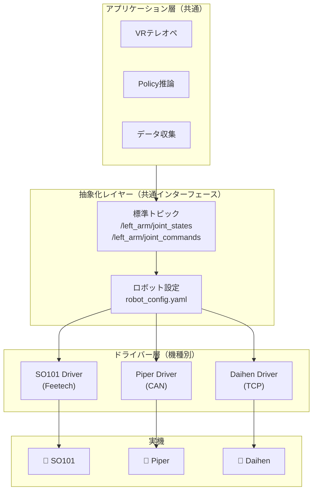

### 関節名の標準化

全ロボットで共通の関節インデックスを使用し、設定ファイルで実機名にマッピングします。

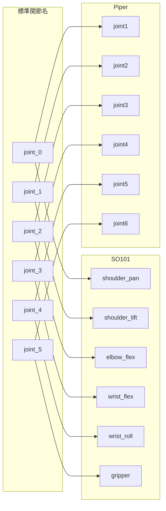

### ロボット設定ファイル例

```yaml
# config/robots/so101.yaml
robot:
  name: so101
  type: so101_follower

  joints:
    count: 6
    mapping:
      joint_0: shoulder_pan
      joint_1: shoulder_lift
      joint_2: elbow_flex
      joint_3: wrist_flex
      joint_4: wrist_roll
      joint_5: gripper

  limits:
    joint_0: { min: -3.14, max: 3.14 }
    joint_1: { min: -1.57, max: 1.57 }
    joint_2: { min: -1.57, max: 1.57 }
    joint_3: { min: -1.57, max: 1.57 }
    joint_4: { min: -3.14, max: 3.14 }
    joint_5: { min: 0.0, max: 0.04 }

  communication:
    type: serial
    port: /dev/ttyACM0
    protocol: feetech

  urdf:
    package: so101_description
    file: urdf/so101.urdf.xacro
```

### ロボット切り替え方法

```bash
# SO101で起動
ros2 launch unity_robot_control vr_teleop.launch.py robot:=so101

# Piperで起動
ros2 launch unity_robot_control vr_teleop.launch.py robot:=piper

# Daihenで起動
ros2 launch unity_robot_control vr_teleop.launch.py robot:=daihen
```

---

## 12. 推論時のROS2連携詳細

学習済みモデルの推論はROS2ノードとして動作し、全ての入出力はROS2トピック経由です。

### 推論ノードの内部構造

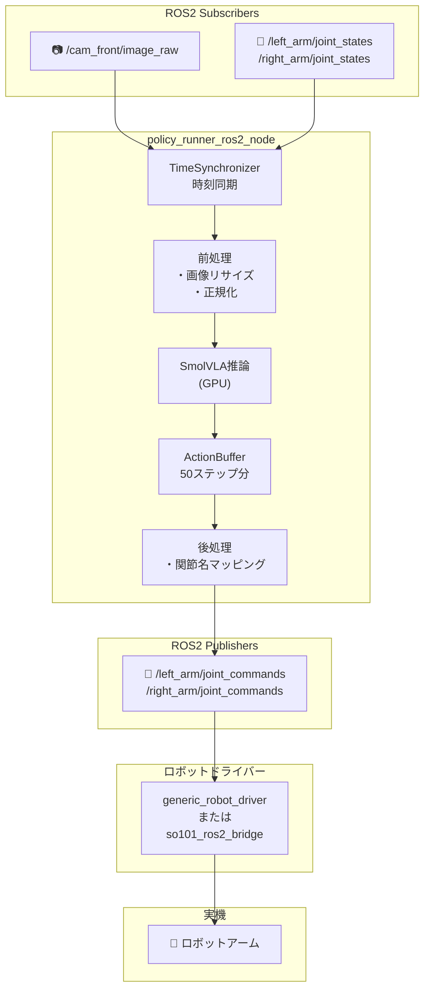

### 推論パラメータ

| パラメータ | デフォルト値 | 説明 |
|-----------|-------------|------|
| `inference_rate` | 1.0 Hz | 推論実行頻度（重い処理） |
| `publish_rate` | 20.0 Hz | コマンド発行頻度 |
| `inference_delay` | 0.4 s | 遅延補償 |
| `chunk_size` | 50 | 予測ステップ数 |
| `device` | cuda:0 | 推論デバイス |

### io.yaml 設定

```yaml
# config/policies/io.yaml
observations:
  observation.images.camera1:
    topic: "/cam_front/image_raw"
    msg_type: "sensor_msgs/msg/Image"

  observation.state:
    topic: "/left_arm/joint_states"
    msg_type: "sensor_msgs/msg/JointState"

action:
  topic: "/left_arm/joint_commands"
  msg_type: "sensor_msgs/msg/JointState"
```

---

## 13. データセットの標準化

異なるロボットで収集したデータを統合して学習できるよう、データセット形式を標準化しています。

### LeRobotデータセット形式

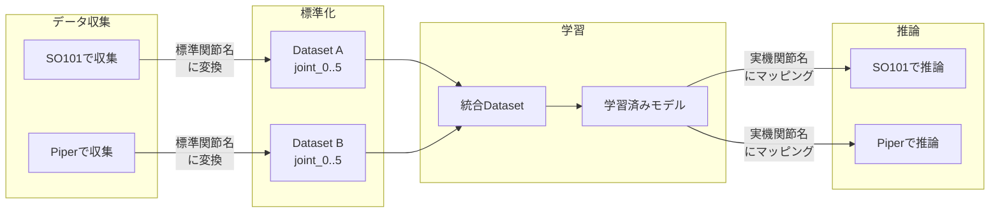

### 標準データ形式

```python
# 全ロボット共通
observation.state = [
    joint_0,  # ベース回転
    joint_1,  # 肩
    joint_2,  # 肘
    joint_3,  # 手首1
    joint_4,  # 手首2
    joint_5,  # グリッパー
]

# デュアルアームの場合
observation.state = [
    left_joint_0, left_joint_1, ..., left_joint_5,
    right_joint_0, right_joint_1, ..., right_joint_5,
]  # 計12要素
```

---

## 14. ライセンス

MIT License
