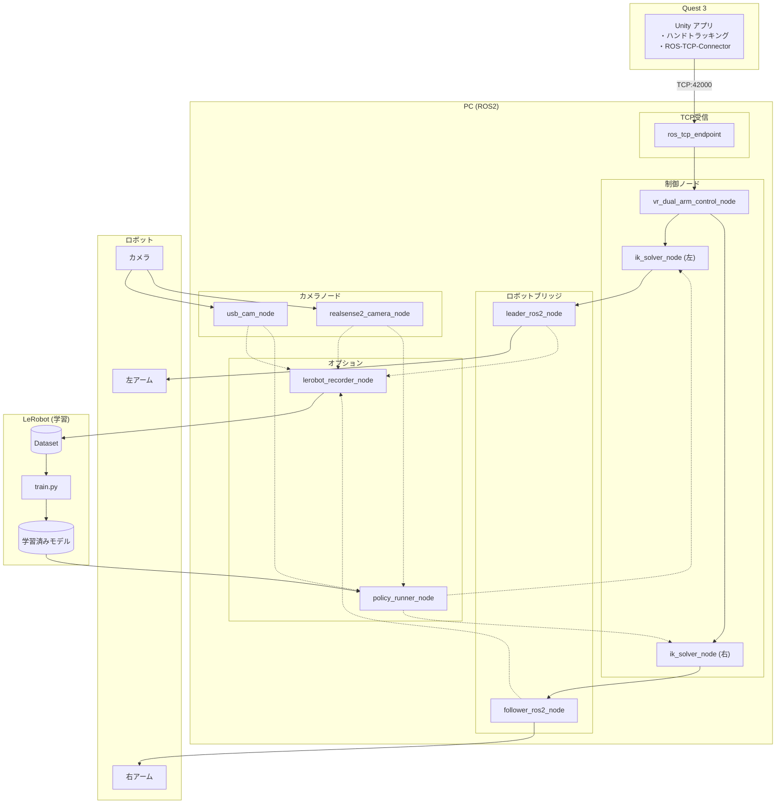
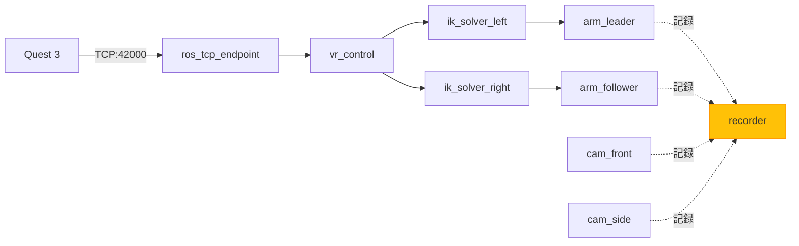
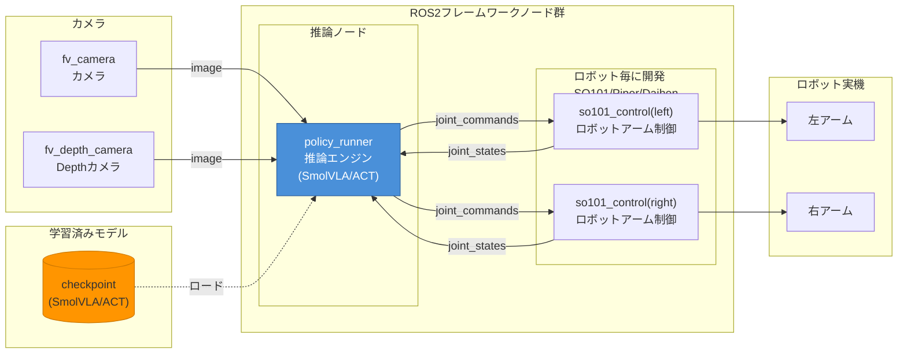
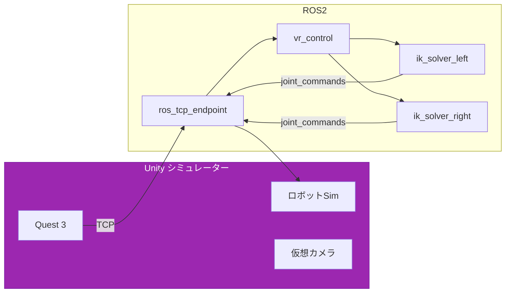
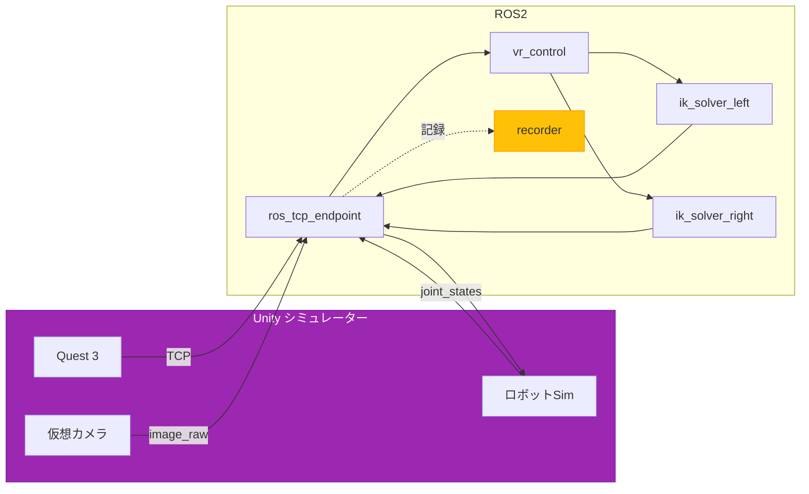
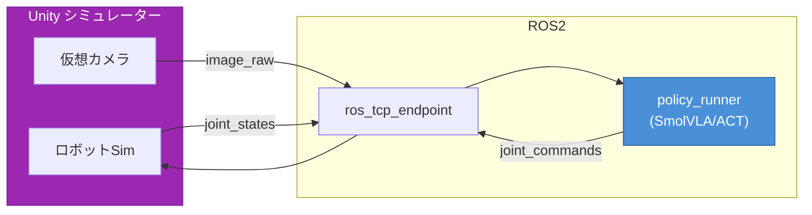
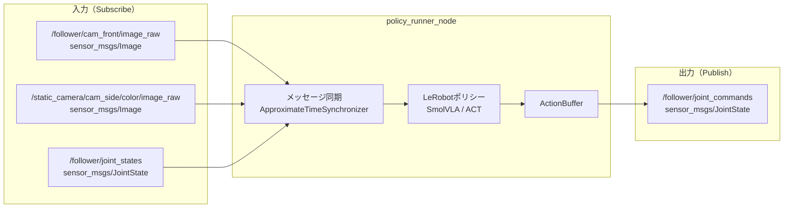
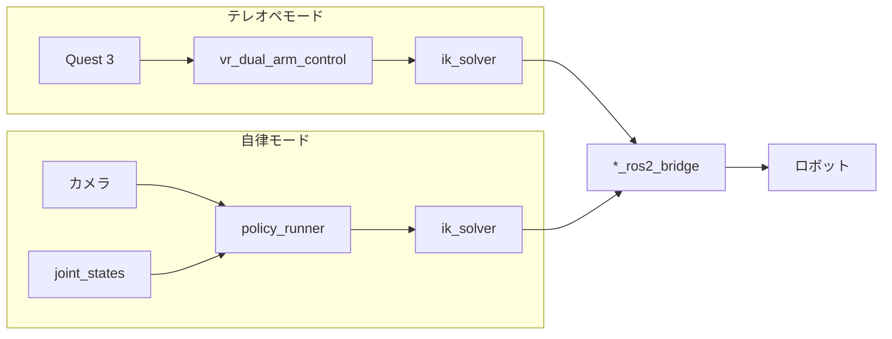
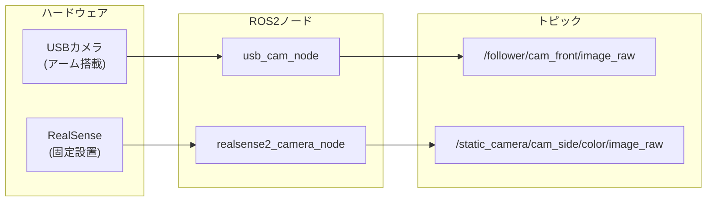

# VR テレオペ + LeRobot 学習システム

## システム構成図



---

## モード別ノード一覧

### テレオペ（学習データ収集）モード

VRでロボットを操作しながら、データを記録するモード。

```
起動コマンド: ros2 launch so101_bringup teleop.launch.py record:=true
```

| ノード名 | 日本語名 | 何をするか | 必須 |
|---------|---------|-----------|:----:|
| ros_tcp_endpoint | TCP通信 | Quest 3 ↔ ROS2 接続 | ✓ |
| vr_control | VR制御 | 手の位置→ロボット座標 | ✓ |
| ik_solver_left | 左IK | 左アーム逆運動学 | ✓ |
| ik_solver_right | 右IK | 右アーム逆運動学 | ✓ |
| arm_leader | リーダーアーム | リーダーアームドライバ | ✓ |
| arm_follower | フォロワーアーム | フォロワーアームドライバ | ✓ |
| cam_front | 前方カメラ | アーム先端映像 | ✓ |
| cam_side | 側方カメラ | 作業エリア映像 | ✓ |
| recorder | データ記録 | 学習データ保存 | 記録時 |



---

### 自律（推論）モード

学習済みモデルでロボットを自律制御するモード。

```
起動コマンド: ros2 launch so101_bringup policy.launch.py \
    robot:=so101 policy_name:=smolvla checkpoint_path:=/path/to/model
```

| ノード名 | 日本語名 | 何をするか | 必須 |
|---------|---------|-----------|:----:|
| policy_runner | 推論エンジン | LeRobotモデルで関節角度を推論 | ✓ |
| so101_control (left) | 左アーム制御 | ロボットドライバ（状態読取＆コマンド送信） | ✓ |
| so101_control (right) | 右アーム制御 | ロボットドライバ（状態読取＆コマンド送信） | ✓ |
| fv_camera | カメラ | アーム先端映像 | ✓ |
| fv_depth_camera | Depthカメラ | 作業エリア映像（RGB-D） | ✓ |



**注意**: VR関連ノード（ros_tcp_endpoint, vr_transform, ik_solver）は**不要**

---

### シミュレーター テレオペモード

Unity シミュレーターをVRで操作するモード（実機なし）。

```
起動コマンド:
# PC側
ros2 launch so101_bringup teleop_sim.launch.py

# Unity側
シミュレーターアプリを起動
```

| ノード名 | 日本語名 | 何をするか | 必須 |
|---------|---------|-----------|:----:|
| ros_tcp_endpoint | TCP通信 | Unity ↔ ROS2 双方向通信 | ✓ |
| vr_control | VR制御 | 手の位置→ロボット座標変換 | ✓ |
| ik_solver_left | 左IK | 左アーム逆運動学 | ✓ |
| ik_solver_right | 右IK | 右アーム逆運動学 | ✓ |



**ポイント**: 実機ドライバ（arm_leader, arm_follower）は**不要**。Unity がロボットをシミュレート。

---

### シミュレーター 学習データ収集モード

Unity シミュレーターでテレオペしながらデータを記録するモード。

```
起動コマンド:
# PC側
ros2 launch so101_bringup teleop_sim.launch.py record:=true

# Unity側
シミュレーターアプリを起動
```

| ノード名 | 日本語名 | 何をするか | 必須 |
|---------|---------|-----------|:----:|
| ros_tcp_endpoint | TCP通信 | Unity ↔ ROS2 双方向通信 | ✓ |
| vr_control | VR制御 | 手の位置→ロボット座標変換 | ✓ |
| ik_solver_left | 左IK | 左アーム逆運動学 | ✓ |
| ik_solver_right | 右IK | 右アーム逆運動学 | ✓ |
| recorder | データ記録 | 学習データ保存 | ✓ |



**データソース**:
- **関節角度**: Unity シミュレーターから `/joint_states` トピック経由
- **カメラ映像**: Unity 仮想カメラから `/image_raw` トピック経由

---

### シミュレーター 自律モード

Unity シミュレーターで学習済みモデルをテストするモード。

```
起動コマンド:
# PC側
ros2 launch so101_bringup policy_sim.launch.py \
    robot:=so101 policy_name:=smolvla checkpoint_path:=/path/to/model

# Unity側
シミュレーターアプリを起動
```

| ノード名 | 日本語名 | 何をするか | 必須 |
|---------|---------|-----------|:----:|
| ros_tcp_endpoint | TCP通信 | Unity ↔ ROS2 双方向通信 | ✓ |
| policy_runner | 推論エンジン | LeRobotモデルで関節角度を推論 | ✓ |



**ポイント**: 実機なしでモデルの動作確認ができる。Sim2Real 前のテストに有用。

---

## モード比較表

| モード | 実機 | シミュレーター | VR | 推論 | 記録 |
|--------|:----:|:-------------:|:--:|:----:|:----:|
| テレオペ | ✓ | - | ✓ | - | - |
| テレオペ + 記録 | ✓ | - | ✓ | - | ✓ |
| 自律 | ✓ | - | - | ✓ | - |
| シミュ テレオペ | - | ✓ | ✓ | - | - |
| シミュ テレオペ + 記録 | - | ✓ | ✓ | - | ✓ |
| シミュ 自律 | - | ✓ | - | ✓ | - |

---

## 全ノード一覧

| カテゴリ | ノード名 | パッケージ | 日本語名 | 何をするか |
|---------|---------|-----------|---------|-----------|
| **通信** | ros_tcp_endpoint | ros_tcp_endpoint | TCP通信 | Quest 3/Unity と ROS2 を TCP:42000 で接続 |
| **制御** | vr_control | vr_control | VR制御 | VRの手の位置・姿勢をロボット座標に変換 |
| **制御** | ik_solver_left | arm_ik_solver | 左IK | 左アームの逆運動学（手先位置→関節角度） |
| **制御** | ik_solver_right | arm_ik_solver | 右IK | 右アームの逆運動学（手先位置→関節角度） |
| **ドライバ** | arm_leader | so101_ros2_bridge | リーダーアーム | リーダーアームの状態読取・コマンド送信 |
| **ドライバ** | arm_follower | so101_ros2_bridge | フォロワーアーム | フォロワーアームの状態読取・コマンド送信 |
| **カメラ** | cam_front | usb_cam | 前方カメラ | アーム先端のUSBカメラ映像を配信 |
| **カメラ** | cam_side | realsense2_camera | 側方カメラ | 作業エリアの俯瞰映像を配信 |
| **記録** | recorder | lerobot_ros | データ記録 | 関節角度＋カメラ映像を記録（学習用） |
| **推論** | policy_runner | so101_ros2_bridge | 推論エンジン | 学習済みモデルで関節角度を推論 |

### ノード詳細

#### 通信ノード

| ノード名 | 入力 | 出力 | 説明 |
|---------|------|------|------|
| **ros_tcp_endpoint** | TCP:42000 (Unity) | ROS2トピック | Unity（Quest 3含む）とROS2の双方向通信を担当 |

#### 制御ノード

| ノード名 | 入力 | 出力 | 説明 |
|---------|------|------|------|
| **vr_control** | `/vr/left_hand`, `/vr/right_hand` | `/left_arm/target_pose`, `/right_arm/target_pose` | VRハンドポーズをロボット座標系の目標ポーズに変換 |
| **ik_solver_left** | `/left_arm/target_pose` | `/left_arm/joint_commands` | 左アームの逆運動学を解く |
| **ik_solver_right** | `/right_arm/target_pose` | `/right_arm/joint_commands` | 右アームの逆運動学を解く |

#### ドライバノード

| ノード名 | 入力 | 出力 | 説明 |
|---------|------|------|------|
| **arm_leader** | `/leader/joint_commands` | `/leader/joint_states` | リーダーアーム（テレオペ時の教示用）の制御 |
| **arm_follower** | `/follower/joint_commands` | `/follower/joint_states` | フォロワーアーム（追従/自律用）の制御 |

#### カメラノード

| ノード名 | 入力 | 出力 | 説明 |
|---------|------|------|------|
| **cam_front** | USBカメラ | `/follower/cam_front/image_raw` | アーム先端の前方視点映像 |
| **cam_side** | RealSense | `/static_camera/cam_side/color/image_raw` | 作業エリアの側方/俯瞰映像 |

#### 記録・推論ノード

| ノード名 | 入力 | 出力 | 説明 |
|---------|------|------|------|
| **recorder** | joint_states, image_raw | ROS2 Bag | 学習用データの記録 |
| **policy_runner** | image_raw, joint_states | `/follower/joint_commands` | LeRobotモデル（SmolVLA/ACT）で推論 |

---

## データフロー

### テレオペ時
```
Quest3 (Unity) → TCP → ros_tcp_endpoint → vr_control → ik_solver → arm_* → ロボット
```

### 記録時
```
ロボット状態 + カメラ映像 → lerobot_recorder → Dataset
```

### 自律時
```
カメラ映像 → policy_runner → ik_solver → *_ros2_bridge → ロボット
```

---

## 自律モード詳細（policy_runner_node）

自律モードでは `policy_runner_node` が VR の代わりに関節角度を生成します。

### 入出力トピック



### Subscribe（入力）

| トピック | メッセージ型 | 内容 |
|---------|------------|------|
| `/follower/cam_front/image_raw` | sensor_msgs/Image | アーム先端カメラ映像 |
| `/static_camera/cam_side/color/image_raw` | sensor_msgs/Image | 俯瞰カメラ映像 |
| `/follower/joint_states` | sensor_msgs/JointState | 現在の関節角度 |

### Publish（出力）

| トピック | メッセージ型 | 内容 |
|---------|------------|------|
| `/follower/joint_commands` | sensor_msgs/JointState | 推論された関節角度（コマンド） |

### 推論パイプライン

```
1. カメラ2台 + 関節状態を同期受信（ApproximateTimeSynchronizer）
      ↓
2. ROS メッセージ → LeRobot 形式に変換
   - Image → numpy配列 (HWC, uint8)
   - JointState → float32 ベクトル
      ↓
3. LeRobotポリシー（SmolVLA/ACT）で推論
   - 入力: 画像 + 関節状態 + タスク指示
   - 出力: 関節角度列（複数ステップ分）
      ↓
4. ActionBuffer に格納（遅延補償付き）
      ↓
5. 20Hz で JointState として Publish
```

### 主要パラメータ

| パラメータ | デフォルト | 説明 |
|-----------|-----------|------|
| `policy_name` | `smolvla` | 使用ポリシー（smolvla / act） |
| `checkpoint_path` | - | 学習済みモデルのパス |
| `device` | `cuda:0` | 推論デバイス |
| `task` | `Pick and Place` | タスク指示（言語条件付け） |
| `inference_rate` | 1.0 Hz | 推論実行レート |
| `publish_rate` | 20.0 Hz | アクション出力レート |

### テレオペ vs 自律の違い



**ポイント**: VR入力の代わりに `policy_runner` が関節角度を生成。それ以降は同じフロー。

---

## カメラ構成

| カメラ | ノード | 用途 |
|--------|--------|------|
| USBカメラ (cam_front) | usb_cam_node | アーム先端の映像 |
| RealSense (cam_side) | realsense2_camera_node | 作業エリアの俯瞰映像 |



カメラ映像は:
- **lerobot_recorder** が記録に使用
- **policy_runner** が自律制御に使用

---

## 起動

```bash
# テレオペ
ros2 launch so101_bringup teleop.launch.py

# テレオペ + 記録
ros2 launch so101_bringup teleop.launch.py record:=true

# 自律
ros2 launch so101_bringup autonomous.launch.py model:=/path/to/model
```
