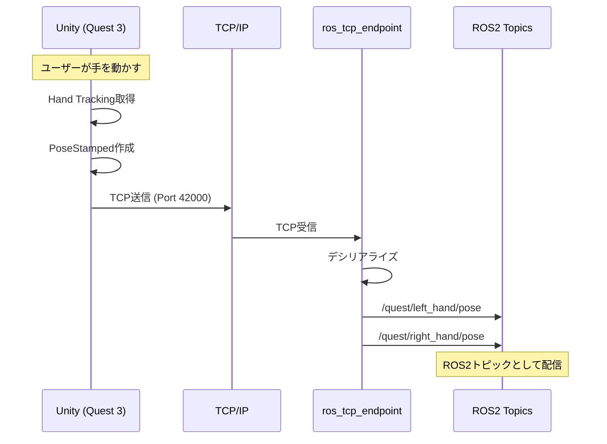
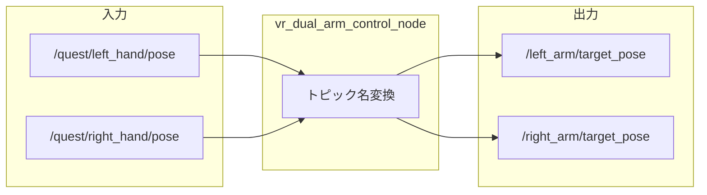
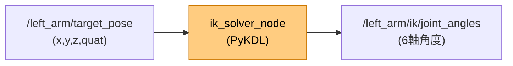
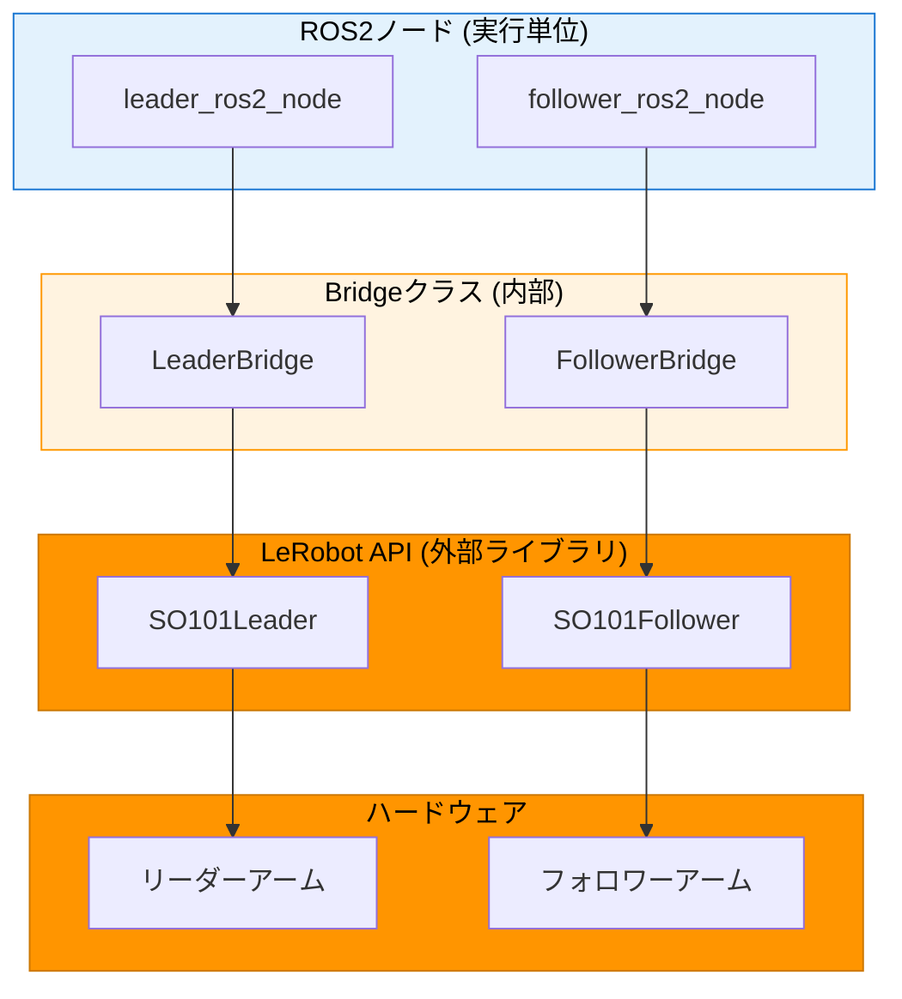
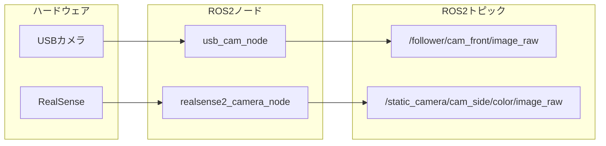
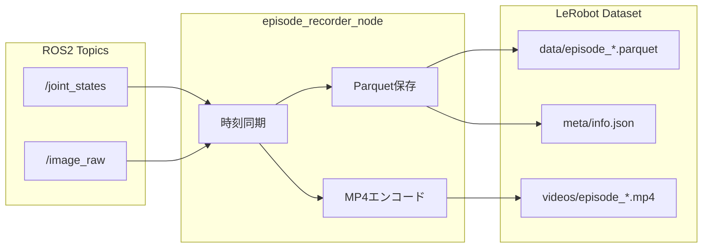
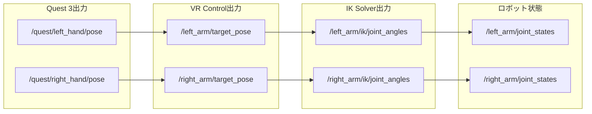
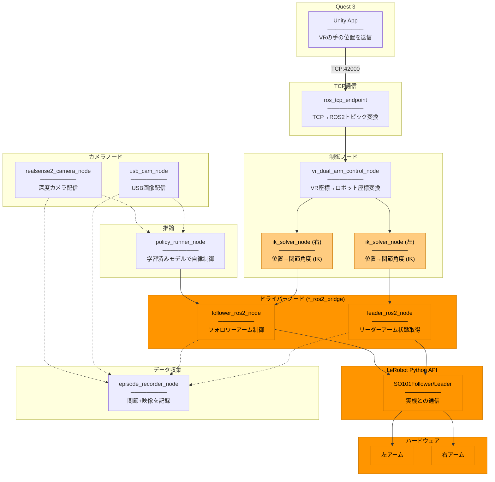

# 技術詳細ドキュメント

ROS2ノード、トピック、通信フローの詳細情報。

概要は [system_overview.md](system_overview.md) を参照。

---

## 1. 通信詳細フロー

### Quest 3 → ROS2 PC



### 使用パッケージ

| 側 | パッケージ | 説明 |
|----|-----------|------|
| **Unity** | ROS-TCP-Connector | Unity用ROS2通信パッケージ |
| **ROS2** | ros_tcp_endpoint | TCPサーバー（Unity公式） |

---

## 2. ノード詳細

### 2.1 ros_tcp_endpoint (TCP受信)

**役割:** UnityからのTCP通信を受信し、ROS2トピックに変換

```
Unity (TCP Client) ──TCP:42000──> ros_tcp_endpoint ──> ROS2 Topics
```

**設定:**
```bash
ros2 run ros_tcp_endpoint default_server_endpoint \
    --ros-args -p ROS_IP:=192.168.1.100 -p ROS_TCP_PORT:=42000
```

**出力トピック:**
| トピック | 型 | 説明 |
|---------|-----|------|
| /quest/left_hand/pose | PoseStamped | VR左手位置・姿勢 |
| /quest/right_hand/pose | PoseStamped | VR右手位置・姿勢 |
| /quest/pose/headset | PoseStamped | ヘッドセット位置 |

---

### 2.2 unity_tcp_endpoint (ラッパー)

**役割:** ros_tcp_endpointの起動・監視・ログ

```python
# 実際の処理
cmd = ['ros2', 'run', 'ros_tcp_endpoint', 'default_server_endpoint', ...]
self.process = subprocess.Popen(cmd)  # 子プロセスとして起動
```

**機能:**
- IPアドレス自動検出
- 接続状態監視
- 受信データログ

---

### 2.3 vr_dual_arm_control_node (マッピング)

**役割:** VRトピック名 → アームトピック名の変換



**現状の実装:** ほぼパススルー（座標変換なし）

**TODO（将来）:**
- 座標変換 (Unity座標系 → ROS2座標系)
- スケーリング
- 安全制限

---

### 2.4 ik_solver_node (逆運動学)

**役割:** エンドエフェクタ位置 → 関節角度

> **凡例:** 🟡薄オレンジ = URDFパラメータ変更のみ（ソースコード共通）



**アルゴリズム:** KDL (Kinematics and Dynamics Library)
- LMA (Levenberg-Marquardt) 数値解法
- URDFからチェーン自動構築

**起動方法（左右別々）:**
```bash
# 左アーム
ros2 run unity_robot_control ik_solver_node --ros-args \
    -p target_pose_topic:=/left_arm/target_pose \
    -p joint_angles_topic:=/left_arm/ik/joint_angles

# 右アーム
ros2 run unity_robot_control ik_solver_node --ros-args \
    -p target_pose_topic:=/right_arm/target_pose \
    -p joint_angles_topic:=/right_arm/ik/joint_angles
```

---

### 2.5 ロボットブリッジ (so101_ros2_bridge等)

**役割:** ROS2トピック ↔ ロボットAPI (LeRobot) の変換

> **凡例:** 🟠オレンジ色 = ロボット変更時に変わる部分



**構造の説明:**

| レイヤー | 名前 | 種類 | 説明 |
|---------|------|------|------|
| ROS2ノード | follower_ros2_node | 実行ファイル | `ros2 run` で起動 |
| Bridgeクラス | FollowerBridge | Pythonクラス | ROS2とLeRobotの橋渡し |
| LeRobot API | SO101Follower | 外部ライブラリ | 実機との通信を担当 |

**重要:** シリアル通信は **LeRobot Python API** が担当します。ブリッジはROS2とLeRobotの橋渡しのみ。

```python
# so101_ros2_bridge/bridge/bridge.py
from lerobot.robots.so101_follower import SO101Follower
from lerobot.teleoperators.so101_leader import SO101Leader
```

**ブリッジの種類（マルチロボット対応）:**

| ブリッジ | ロボット | 通信方式 | LeRobot API |
|---------|---------|---------|-------------|
| **so101_ros2_bridge** | SO101 | USB Serial (Feetech) | SO101Follower/Leader |
| **piper_ros2_bridge** | Piper | CAN | PiperFollower/Leader |
| **daihen_ros2_bridge** | Daihen OTC | TCP/IP | DaihenFollower/Leader |
| **koch_ros2_bridge** | Koch | USB Serial (Dynamixel) | KochFollower/Leader |

**データフロー:**
```
【状態読み取り】
LeRobot API (.get_observation())
    ↓
*_ros2_bridge (単位変換: degrees→radians)
    ↓
/joint_states_raw (JointState)

【コマンド送信】
/joint_commands (Float64MultiArray)
    ↓
*_ros2_bridge (単位変換: radians→degrees)
    ↓
LeRobot API (.send_action())
    ↓
実機
```

---

### 2.6 カメラノード

**役割:** カメラ画像をROS2トピックに配信



**使用パッケージ:**
| カメラ | パッケージ | ノード |
|--------|-----------|--------|
| USBカメラ | usb_cam | usb_cam_node |
| RealSense | realsense2_camera | realsense2_camera_node |

**設定ファイル:** `so101_bringup/config/so101_cameras.yaml`
```yaml
cameras:
  - name: cam_front
    camera_type: usb_camera
    namespace: follower

  - name: cam_side
    camera_type: realsense2_camera
    namespace: static_camera
```

---

### 2.7 episode_recorder_node (データ収集)

**役割:** テレオペ中のデータを **直接 LeRobot Dataset 形式** で保存



**出力形式:**

```
lerobot_dataset/
├── meta/
│   ├── info.json          # データセット情報
│   ├── stats.json         # 統計情報
│   └── episodes.jsonl     # エピソード一覧
├── data/
│   ├── episode_000000.parquet
│   └── ...
└── videos/
    ├── episode_000000.mp4
    └── ...
```

**メリット:**
- ROS2 Bag 不要（ストレージ節約）
- 変換ステップ不要（即学習可能）
- MP4 で画像圧縮（Bag より大幅に小さい）

---

## 3. ノード一覧

| ノード | パッケージ | 役割 |
|--------|-----------|------|
| default_server_endpoint | ros_tcp_endpoint | TCP受信 (Unity通信) |
| unity_tcp_endpoint | unity_robot_control | TCP監視ラッパー |
| vr_dual_arm_control_node | unity_robot_control | VRトピック→アームトピック変換 |
| ik_solver_node | unity_robot_control | 逆運動学 (KDL) |
| leader_ros2_node | *_ros2_bridge | リーダーアーム状態読み取り |
| follower_ros2_node | *_ros2_bridge | フォロワーアーム制御 |
| usb_cam_node | usb_cam | USBカメラ配信 |
| realsense2_camera_node | realsense2_camera | RealSenseカメラ配信 |
| episode_recorder_node | unity_robot_control | データ記録 |
| policy_runner_node | *_ros2_bridge | 推論実行 |

---

## 4. トピック一覧



---

## 5. 全ノード関係図

> **凡例:** 🟠オレンジ色 = ロボット変更時に変わる部分、🟡薄オレンジ = パラメータ(URDF)変更



### ノード役割まとめ

| ノード | 何をする？ |
|--------|----------|
| **ros_tcp_endpoint** | Quest 3からのTCP通信をROS2トピックに変換 |
| **vr_dual_arm_control_node** | VR座標系をロボット座標系に変換 |
| **ik_solver_node** | 手先の位置から関節角度を計算（逆運動学） |
| **leader_ros2_node** | リーダーアームの状態を読み取る（教示用） |
| **follower_ros2_node** | フォロワーアームに指令を送る（追従用） |
| **usb_cam_node** | USBカメラの映像を配信 |
| **realsense2_camera_node** | RealSenseカメラの映像を配信 |
| **episode_recorder_node** | テレオペ中の関節角度＋映像を記録 |
| **policy_runner_node** | 学習済みモデルでロボットを自律制御 |

---

## 6. VR↔ロボット座標変換

### 座標系の違い

| 座標系 | 軸 | 手系 |
|--------|-----|------|
| Unity (Quest 3) | Y-up | 左手系 |
| ROS2 | Z-up | 右手系 |

### ロボット設置パターン

| 設置 | base_link の向き | 補正 |
|------|-----------------|------|
| 床置き | Z-up | なし |
| 天吊り | Z-down | Z軸反転 |
| 壁掛け | X/Y-up | 90度回転 |

### 設定ファイル

```yaml
# config/vr_transform.yaml
vr_transform:
  coordinate_system:
    x: z    # Unity Z → ROS2 X
    y: x    # Unity X → ROS2 Y
    z: y    # Unity Y → ROS2 Z

  workspace:
    scale: 1.0
    offset:
      x: 0.3
      y: 0.0
      z: 0.2

  robot_mounting:
    type: "floor"       # floor / ceiling / wall

  workspace_limits:
    x: [-0.5, 0.5]
    y: [-0.5, 0.5]
    z: [0.0, 0.6]
```

### URDFとの関係

| 用途 | URDF必要？ |
|------|-----------|
| 座標系変換 (Unity↔ROS2) | 不要 |
| スケーリング・オフセット | 不要 |
| 設置向き補正 | 不要 |
| **IK計算** | **必要** |

**URDFはIK計算にのみ必要**。座標変換は設定ファイルで対応。

---

## 7. 起動手順

```bash
# 1. TCP Endpoint起動
ros2 run unity_robot_control unity_tcp_endpoint

# 2. VR制御ノード起動
ros2 run unity_robot_control vr_dual_arm_control_node

# 3. IKソルバー起動（左右）
ros2 run unity_robot_control ik_solver_node --ros-args \
    -p target_pose_topic:=/left_arm/target_pose
ros2 run unity_robot_control ik_solver_node --ros-args \
    -p target_pose_topic:=/right_arm/target_pose

# 4. ロボットドライバー起動
ros2 launch so101_ros2_bridge dual_arm.launch.py

# 5. データ記録開始
ros2 run unity_robot_control episode_recorder_node
ros2 service call /episode/start std_srvs/srv/Trigger
```

または一括起動:
```bash
ros2 launch unity_robot_control vr_dual_arm_teleop.launch.py
```
